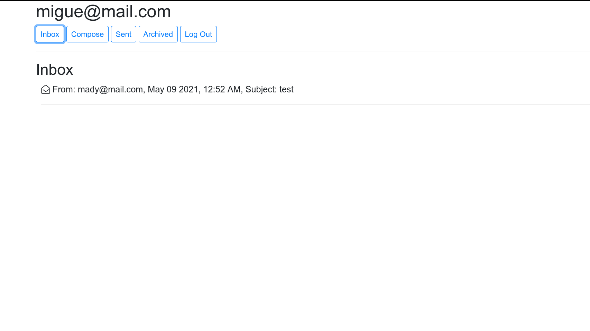
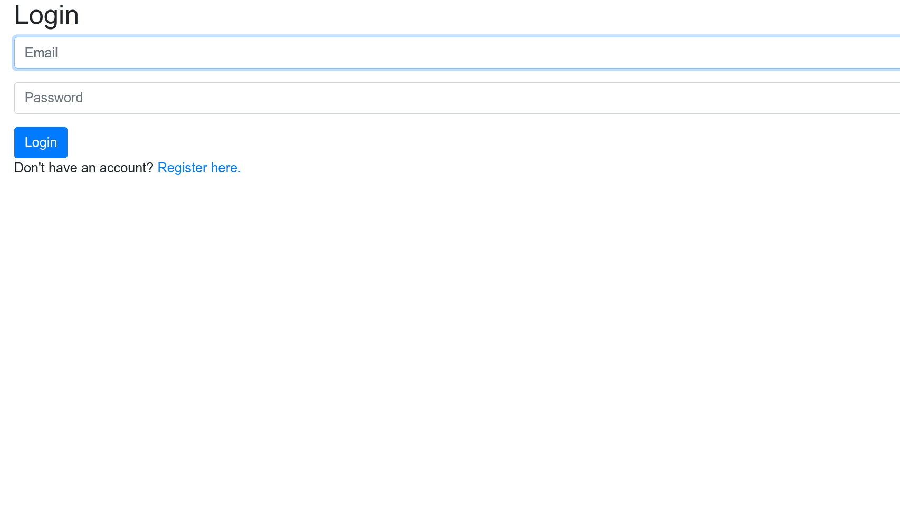
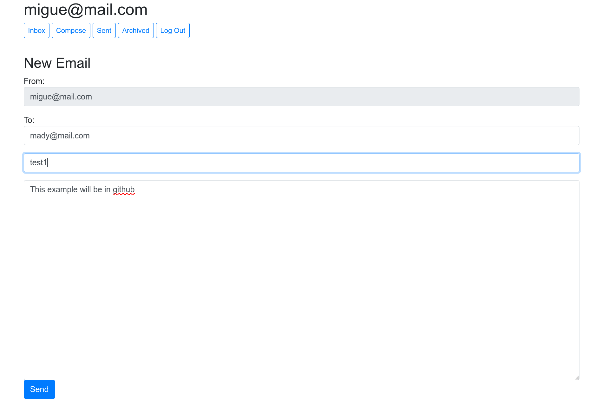
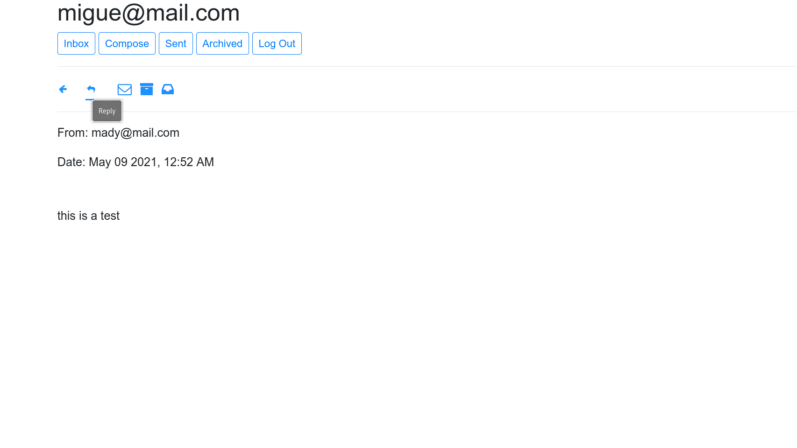
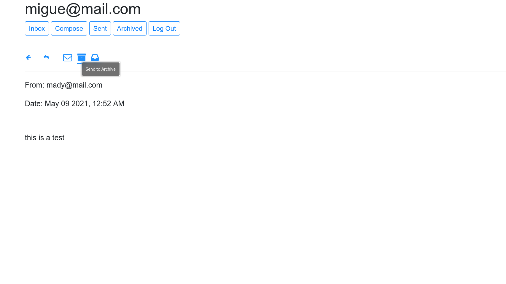

#Fourth project from CS50's Web programming with Python and Javascript.
##Design a front-end for an email client that nakes API calls to send and receive emails.
###Features
- Inbox
- Send email
- View Email
- Archive and Unarchive
- Reply

Some screenshot from the app.

Demostration
https://youtu.be/qhDX3SN_NZU